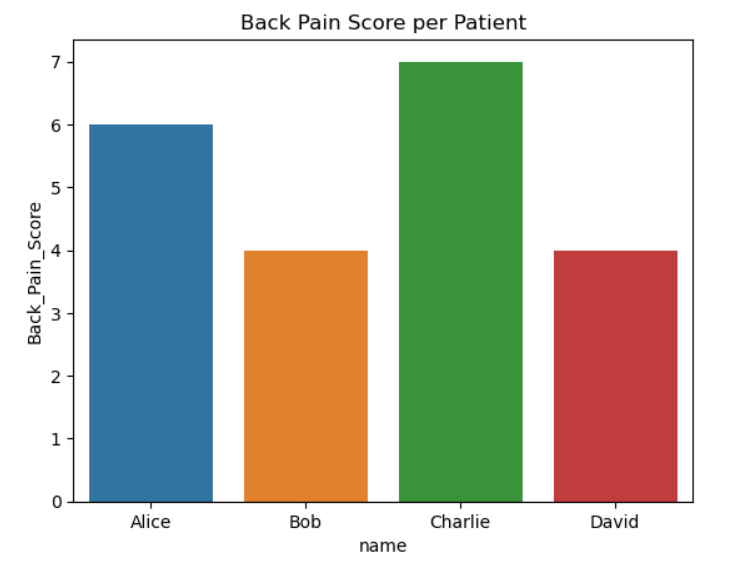
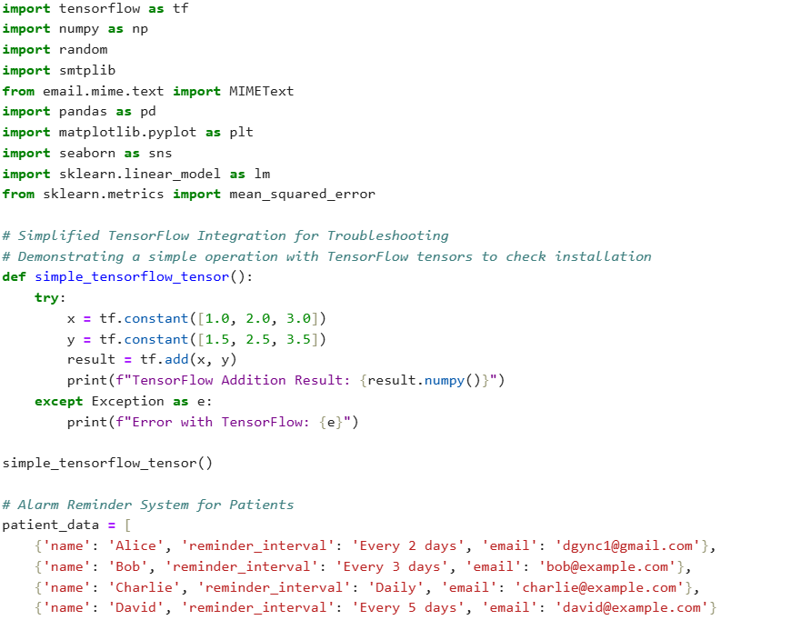

# Data_Science_Insights

Real-world data science implementations showcasing actionable insights for wellness, healthcare, and business analytics.

## 🎯 Overview

This repository contains practical data science projects that demonstrate:
- Healthcare analytics and patient outcome tracking
- ROI-driven business insights
- Automated systems for clinical workflows
- Enterprise-scale data processing

## 📊 Featured Implementations

### 1. Patient Outcome Analytics
Analysis of back pain scores across patient cohorts using Python visualization libraries.

### 2. Enterprise ML Integration
TensorFlow implementation with proper error handling and validation for healthcare applications.

### 3. Clinical Reminder System
Automated patient communication system with customizable reminder intervals for improved compliance and outcomes.

## 🛠️ Technologies Used
- **Python** (Pandas, NumPy, Matplotlib, Seaborn)
- **TensorFlow** & Scikit-learn
- **SQL** & Cloud Platforms (Azure)
- **Statistical Analysis** & Predictive Modeling

## 🏢 Professional Background
- Subject Matter Expert at Fortune 5 technology companies
- Medical education contributor (exam question author)
- Security cleared for enterprise environments
- 10+ years in health-tech and data science

## 📁 Repository Contents

Data_Science_Insights/
├── README.md
├── patient_analytics.py      # Healthcare outcome analysis system
├── reminder_system.py        # Automated patient communications
├── ml_implementations.py     # Enterprise ML/AI implementations
└── images/
├── back_pain_analysis.png
└── tensorflow_integration.png

## ⚠️ Note on Code
The Python files contain pseudo-code representations of proprietary systems developed for Fortune 5 companies and healthcare organizations. Full implementation details and production code are available for discussion under appropriate agreements.

## 🔗 More Projects
For my complete portfolio including 10+ production AI/ML projects, visit:
- [Main Portfolio](https://dgsc23.github.io/data-science-health-ai-portfolio/)
- [LinkedIn](https://linkedin.com/in/davidgramlingphd)

---

*All patient data shown is anonymized. Production code available for review under NDA. Contact for detailed discussions about implementation.*
